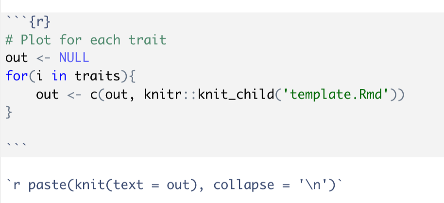

# R Cheatsheet

What are some of your favorite R functions/packages/commands? Maybe someone else can learn from you too!

## Tidyverse

* [Cheatsheets](https://www.rstudio.com/resources/cheatsheets/)
* `glue` instead of `paste`

```
species <- "c_elegans"
glue::glue("The species is {species}")
> The species is c_elegans
```
* `tidyr::separate_rows()` to split one cell into several rows
* `dplyr::case_when()` instead of `ifelse`

```
# use this
new_starwars %<>% dplyr::filter(eye_color_new == "cool")

# instead of this
new_starwars <- new_starwars %>% dplyr::filter(eye_color_new == "cool")
```
* Introduction to [dplyr](https://cran.r-project.org/web/packages/dplyr/vignettes/dplyr.html)
* Introduction to [tidyr](https://cran.r-project.org/web/packages/tidyr/vignettes/tidy-data.html)
* Introduction to [readr](https://cran.r-project.org/web/packages/readr/vignettes/readr.html)
* `lubridate` for dates!

## Ploting
* `plotly::ggplotly()` to create interactive ggplot graphs
* `gganimate` to create animation plots
* [Package to help with silly ggplot things](https://brandmaier.github.io/ggx/)

## R markdown

* Render an R markdown from a script using `rmarkdown::render("file.Rmd")`
* Set default to not print code or messages: `knitr::opts_chunk$set(echo = FALSE, message = FALSE, warning = FALSE)`
* Nice R markdown layout with table of contents:

```
---
title: "Linkage Mapping Report"
date: "`r format(Sys.time(), '%d %B, %Y')`"
output: 
    html_document:
        theme: lumen
        toc: yes
        toc_float:
          collapsed: true
          smooth_scroll: false
---
```

* If you have a markdown report where you will be looping through many items and making the same plots (i.e. linkage mapping report for all drugs and all traits), you could think of writing a series of markdown files to make dynamic headings for each drug/trait that will be placed in the TOC for easy maneuvering:



  * Note: All environmental variables will be transfered from original markdown to template markdown. You can then create a dynamic header (i.e. header that says the trait name) using "## `r i`" (outside of a code chunk) in the template file (where `i` is the trait name from the loop)

## Misc.

* set working directory as the location of the active file

```
setwd(dirname(rstudioapi::getActiveDocumentContext()$path))
```
* `DT:datatable()` to create interactive tables
* `%<>%` allows you to make changes to a current data frame and save over that dataframe
* `data.table::fread()` faster and easier way to read in `.tsv` and `.csv` (or lots of types of files). For more, check out Dan Cook's [blog post](https://www.danielecook.com/speeding-up-reading-and-writing-in-r/)
